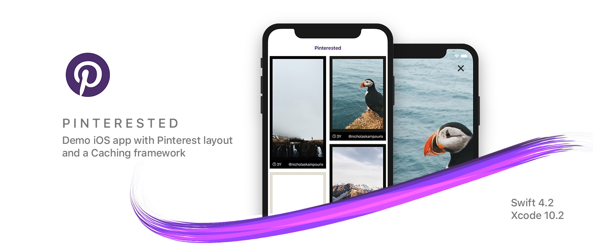

# Pinterested

## Development
- Swift 4.2
- XCode 10.2

## Getting Started
To run this project for development or debugging purposes, please follow the instruction below. The app is written on Swift 4.2 on Xcode 10.2

### Prerequisites
Make sure you have CocoaPods installed. You can install it by running this command on Terminal.
```
$ sudo gem install cocoapods
```
See [Getting Started on CocoaPods](https://guides.cocoapods.org/using/getting-started.html) for more informaiton.


### Installation 
- Open Terminal and head over to your project directory. After that, run the following command to install pods:
```
$ pod install
```
- Navigate to project directory and open workspace using *Pinterested.xcworkspace*
- Build and run the application on simulator or actual device running iOS 10.0 or later using Xcode 10.x

## Features
- Pinterest Layout
- Image gallery with cached images
- Lottie based pull-to-refresh
- Cool transition for image details 🎨

## Technical Notes

### Architecture
- The architecture of this app is based on MVC along with Factory and Coordinator.
- Factory is used for modules construction.
- Coordinator is used for navigation.

### Code Structure
Code has been strucutred into two main categories, Sources and Resources:
- Sources contain all code files, views, extensions, business logic, etc.
- Resources contains Assets, Fonts, etc.

### Code Coverage
- Test cases for Cache framework are added
- A sample UI test case added for Pinterested app
- Code Coverage is upto 85%.

### Third Party
- Lottie (For pull-to-refresh)
- Hero (For transitions)

## Built With

* [CocoaPods](https://cocoapods.org/) - Dependency Management

## Versioning

Version 1.0
For more information on versioning, see [Semantic Versioning](http://semver.org/).

## Authors

* **Muhammad Abdul Subhan** - (https://github.com/mabdulsubhan)

## License

This project is licensed under the MIT License - see the [LICENSE.md](LICENSE.md) file for details

